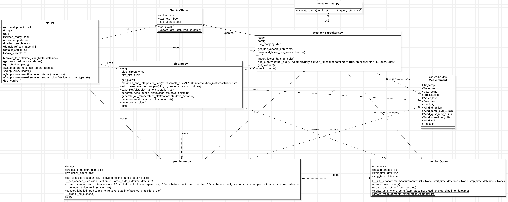

<!-- TOC -->
* [Development Environment](#development-environment)
* [Project Structure](#project-structure)
  * [weather_data.py](#weatherdatapy)
  * [Handling of timezones](#handling-of-timezones)
  * [plotting.py](#plottingpy)
    * [Adding additional metrics to the plots](#adding-additional-metrics-to-the-plots)
    * [Resampling and Interpolation](#resampling-and-interpolation)
  * [prediction.py](#predictionpy)
  * [install.sh](#installsh)
  * [autostart](#autostart)
* [Class Diagram / UML](#class-diagram--uml)
* [Tech stack](#tech-stack)
* [Environment](#environment)
  * [Run in development mode (Docker)](#run-in-development-mode--docker-)
  * [Run in development mode (Python)](#run-in-development-mode--python-)
* [Logs](#logs)
* [Logging](#logging)
* [Code Documentation](#code-documentation)
* [Unit Testing](#unit-testing)
* [CSV Import](#csv-import)
* [Accessing the application](#accessing-the-application)
* [Configuration](#configuration)
* [Updating the application](#updating-the-application)
* [Adding new stations](#adding-new-stations)
* [Adding new plots](#adding-new-plots)
* [Adding new measurements to the dashboard](#adding-new-measurements-to-the-dashboard)
* [Predictions](#predictions)
  * [Handling of NA values](#handling-of-na-values)
  * [List of features](#list-of-features)
  * [Measuring Accuracy](#measuring-accuracy)
  * [Implementation into production](#implementation-into-production)
* [Shutdown](#shutdown)
* [Known Issues](#known-issues)
* [Improvements](#improvements)
  * [Sketches of dashboard redesign](#sketches-of-dashboard-redesign)
* [Future Roadmap](#future-roadmap)
<!-- TOC -->

---

# Development Environment
The weather monitor was tested and developed with the following environment:

- Raspberry Pi 4
- Raspberry Pi OS (64-bit, with desktop)
   - Release date: September 22nd 2022
   - Kernel version: 5.15
   - Debian version: 11 (bullseye)
- 32 GB Micro SD-Karte
- [Waveshare Display 10.1](https://www.waveshare.com/wiki/10.1inch_HDMI_LCD_(B))

# Project Structure
The project is structured as follows:
```bash
├── autostart # Autostart script that is executed on boot
├── DEVELOPMENT.md # Development documentation
├── docker-compose-dev.yml # Docker compose file for development
├── docker-compose.yml # Docker compose file for production
├── Dockerfile # Dockerfile for production
├── download_csvs.sh # Script to download CSV files for historical weather data from the web
├── download_model.sh # Script to download the prediction model from the web
├── example.env # Example environment file. InfluxDB password is stored here
├── images # Images used in README.md
│   ├── banner.jpg
│   ├── dashboard.png
│   ├── mockup_sketch_no_warnings.png 
│   ├── mockup_sketch_warnings.png
│   ├── dashboard_station_selection.png
│   ├── detailed_plot.png
│   ├── Intro.gif
│   └── loading_screen.gif
│   └── uml.png
├── install.sh # Convenience script to install the weather monitor
├── prediction # Prediction related files
│   ├── input # Input data for the prediction model
│   │   ├── input.csv
│   │   ├── messwerte_mythenquai_2007-2021.csv
│   │   └── messwerte_tiefenbrunnen_2007-2021.csv
│   └── weather_prediction.ipynb # Jupyter notebook to train the prediction model
├── README.md # Readme file. Installation instructions are here.
├── requirements.txt # Python requirements for production and development
└── src # Source code
    ├── app.py # Main application. Flask endpoints are defined here. Contains startup hook and main loop. 
    ├── plotting.py # Plotting functions using Plotly. Saves plots as SVGs to the static folder.
    ├── prediction.py # Prediction functions. Uses the prediction model to predict the weather. Includes caching logic.
    ├── service_status.py # Service status functions. Checks if the weather monitor is running and if the weather data is up to date.
    ├── static # Static files. Contains the SVGs generated by plotting.py during runtime.
    │   └── images # Images used in the dashboard
    │       └── direction.png # Image used in the wind direction prediction visualization
    ├── templates # HTML templates. Contains the HTML templates for the dashboard.
    │   ├── current.html # Current weather subpage
    │   ├── index.html # Navigation and header
    │   ├── loading.html # Loading screen
    │   ├── plot.html # Detailed plot subpage
    │   ├── plots.html # Plots slider subpage
    │   ├── prediction.html # Prediction subpage
    │   └── station.html # Station subpage
    ├── tests.py # Unit tests
    ├── weather_data.py # Weather data functions. Fetches the weather data from the web and stores it in InfluxDB. Given by the project supervisor. Slightly modified, see below.
    └── weather_repository.py # Weather repository functions. Includes weather_query logic that is passed to weather_data.py and used throughout the application.
```

## weather_data.py
The `weather_data.py` file contains functions to communicate with the API and the database. The file fetches data from the API and stores it in the database. 

This file was provided by the project owner and was slightly modified in order to match the use case. These modifications include the following:
- execute_query function 
  - The `execute_query` function is used to execute a query on the database. It takes the query as a parameter and returns the result of the query.
  - The query tries to catch any exception that might occur and returns `None` if an exception occurs.
  - In this way, we can utilize the existing database connection and do not have to create a new connection for every query.

## Handling of timezones
  - The data structure returned by the database client, includes the timestamp in UTC format. 
  - The timestamps are converted to the local timezone (default: Europe/Zurich) by default.
  - The conversion is done within the `run_query()` function in `weather_repository.py`.
  - The timezone is changed by default because the data is mostly used to visualize in the dashboard. The dashboard displays the data in the local timezone of the main customer (Zurich, Switzerland).

## plotting.py
The `plotting.py` file contains functions to generate plots using Plotly. The plots are saved as SVGs to the static folder. The SVGs are then embedded in the HTML templates.

Some plots have the parameter `days_delta` which is used to specify the number of days to look back in the data and plot.

Some plots also include the prediction values from the latest measurement on the plot. The prediction values are calculated using the `prediction.py` file.

### Adding additional metrics to the plots
The function `add_mean_min_max_to_plot()` in `plotting.py` is used to add the mean, min and max values to the plot. The function takes the plot as a parameter and returns the plot with the mean, min and max values added.

The values are represented with their corresponding unit. The unit is defined in the `weather_repository.py` file.

### Resampling and Interpolation
If the days_delta parameter is set to a value greater than 1, the data is resampled. The resampling is done using the `resample()` function from Pandas and uses the `mean()` function.
Per default the resampling happens on an hourly basis. This can be changed by changing the `resample_rule` parameter in the `resample_and_interpolate_data()` function.

Read more on resampling [here](https://pandas.pydata.org/pandas-docs/stable/user_guide/timeseries.html#resampling).

The resampling is followed by an interpolation. The interpolation is done using the `interpolate()` function from Pandas and uses the `linear` method per default. This can be changed by changing the `interpolation_method` parameter in the `resample_and_interpolate_data()` function. 

This is done because the resampling can lead to missing values in the data. The interpolation fills these missing values.

Read more in the documentation to the [interpolate()](https://pandas.pydata.org/pandas-docs/stable/reference/api/pandas.DataFrame.interpolate.html) function.

## prediction.py
The `prediction.py` file contains functions to predict the weather. The prediction model is loaded from the `src` folder directly. The model is trained in the `weather_prediction.ipynb` notebook. The notebook is located in the `prediction` folder.

## install.sh
The installation script is used to install the weather monitor. It is a convenience script that installs the weather monitor and all its dependencies.

The installation script will install the following services and applications:
- [Docker](https://www.docker.com/) 
- [Docker Compose](https://docs.docker.com/compose/)
- [InfluxDB](https://www.influxdata.com/products/influxdb-overview/) (Time series database as Docker container)
- Weather Monitor (The application as Docker container)
- [Watchtower](https://containrrr.dev/watchtower/) (Service to automatically update Docker containers as Docker container)
- autostart script (Script that is executed on boot. Opens the dashboard in the browser)
  - The script opens Chromium in full screen mode on boot. This can be disabled by commenting out the last line of the script.

> Through the docker restart policy, the weather monitor will automatically restart if it crashes or the Raspberry Pi reboots.

## autostart
The autostart script is executed on boot. It opens the dashboard in the browser.

The script was developed and forked from the following resources:
- https://forums.raspberrypi.com/viewtopic.php?t=212015
- https://gist.github.com/rampfox/085bf3ffb9ff51e114bf7afdf3ced71b

It starts the browser within the LXDE desktop environment. The script opens Chromium in full screen mode on boot and disables error messages, infobars, and starts the browser in fullscreen mode.

# Class Diagram / UML
Because the project is not using classes that much, the UML provided shows the content of each Python file. These files are then represented as Class in the UML. The actual classes within the Python files are modeled as separate Class entities on the diagram.

The `weather_data.py` file is only partially shown on the diagram. The function shown on the diagram is the one that was added to the existing file that was given by the project owner.

The function parameters and attributes also include the data types if the data type is primitive. Dependencies between files and classes are also represented in the form of one way arrows.



# Tech stack
The weather monitor is built with the following technologies:
- [Docker](https://www.docker.com/) used to containerize the application
- [Docker Compose](https://docs.docker.com/compose/) used to orchestrate the application
- [Python](https://www.python.org/) as programming language
    - Used version: 3.10
- [Flask](https://flask.palletsprojects.com/en/2.0.x/) as web framework
- [Plotly](https://plotly.com/python/) as plotting library
- [sci-kit learn](https://scikit-learn.org/stable/) used to make predictions with the help of [K-nearest neighbors algorithm](https://scikit-learn.org/stable/modules/generated/sklearn.neighbors.KNeighborsRegressor.html)
- [schedule](https://schedule.readthedocs.io/en/stable/) used to schedule the generation of predictions, plots and health checks
- [NumPy](https://numpy.org/) used to work with arrays
- [Pandas](https://pandas.pydata.org/) used to work with dataframes
- [requests](https://docs.python-requests.org/en/master/) used to make HTTP requests to the API as well as to download CSV files
- [InfluxDB](https://www.influxdata.com/) used as database. Official python client is used to communicate with the database
    - Used version: 1.8 (limitation from weather_data.py script)
- [Bash scripts](https://www.gnu.org/software/bash/) used to automate the download of files on build time and the installation of the weather monitor
- [Intro.js](https://introjs.com/) used to provide a guided tour of the weather monitor
- [Bulma](https://bulma.io/) used as CSS framework
- [Pickle](https://docs.python.org/3/library/pickle.html) used to serialize and deserialize the prediction model

All python dependencies are also listed in the `requirements.txt` file with their respective version.

# Environment
The weather monitor is built with Docker. The `Dockerfile` is used to build the image and the `docker-compose.yml` file is used to run the image. The `docker-compose-dev.yml` file is used to run the image in development mode.

## Run in development mode (Docker)
> **Note**: The scripts used are based on a Linux environment. They may not work on other operating systems. On Windows the scripts can be run using [WSL](https://docs.microsoft.com/en-us/windows/wsl/install-win10).

First the current model has to be downloaded using the script `download_model.sh`:
```bash
./download_model.sh
```
After that the model file has to be moved to the `src` folder:

```bash
mv weather_model.pkl ./src/weather_model.pkl
```

The weather monitor can be run in development mode using the `docker-compose-dev.yml` file. This file is configured to use the `Dockerfile` file in the root of the project. This means that the Docker image will be built locally instead of pulling the image from the GitHub Container Registry.

The following command can be used to run the weather monitor in development mode:
```bash
docker compose -f docker-compose-dev.yml up -d --build --force-recreate --remove-orphans
```

## Run in development mode (Python)
Follow the steps from above apart from the last one. Instead of running the weather monitor in Docker, it can be run in Python. The following command can be used to run the weather monitor in development mode:

A minimum version of [Python 3.10](https://www.python.org/downloads/) is required to run the weather monitor.

> **Note**: The `requirements.txt` file has to be installed first. This can be done using the following command:
> ```bash
> pip install -r requirements.txt
> ```
> 
```bash
docker compose -f docker-compose-dev.yml up -d influxdb
python3 src/app.py
```

This way we will only run the InfluxDB database in Docker and the rest of the application will be run in Python. This is useful if you want to make changes to the application and see the changes without rebuilding the Docker image every time.

# Logs
Logs can be viewed through the Docker container logs. The following command can be used to view the logs of the weather monitor container:
```bash
sudo docker logs -f fhnw-ds-cde1-wettermonitor-weather-monitor-1
```

You may have to replace `fhnw-ds-cde1-wettermonitor-weather-monitor-1` with the name of the container. The name of the container can be found using the following command:
```bash
sudo docker ps
```

The matching container name will be listed in the `NAMES` column of the container running under the `ghcr.io/fhnw-ivy/fhnw-ds-cde1-wettermonitor:main` image.

If you're running the weather monitor in development mode and with Python, the logs can be viewed in the execution terminal.

# Logging
The logging is done with the help of the [logging](https://docs.python.org/3/library/logging.html) module. The default logging level is `DEBUG`. The logging level can be changed by setting the level parameter in the `logging.basicConfig` function in the `src/app.py` file.

Each file of the project that uses the logging module gets its own logger. The singleton logger is retrieved by using the `getLogger` function of the logging module. The logger name is per default "app".

# Code Documentation
The code is documented using docstrings directly in the code and partly using comments.

Some specific parts of the code are also documented in this file you are currently reading.

# Unit Testing
The unit tests are made with the coverage package. The tests are located in the `src` folder. The tests are executed with the following command:
```bash
cd src
python -m tests -v
```

The tests are not covering all the code. The tests are only covering the code that is related to the query generation and some visualization code.

# CSV Import
The application relies on data that is provided in a CSV format. This enables a fast startup process without the need of requesting a larger amount of data over HTTP(S). 

The CSV files are downloaded from the [Wetterstation Daten](https://data.stadt-zuerich.ch/dataset/sid_wapo_wetterstationen) and are stored in the `src/csv` folder.

The CSV are provided for the import in the following order with the first entry being always available and the last entry being the one if the remote host is available:
1. Per default a set of CSV files are versioned in the repository. This is done to make the application also usable if the remote host from where the CSV files are downloaded is not available.
2. The CSV files are downloaded on build time using the `download_csv.sh` script.
3. The CSV files are downloaded on run time within the initialization of the application. The function replaces the CSV from the layer above if the download is successful.

This layered system ensures, that the loading time of the application is reasonably low (best case scenario) or historical data is available at all to import (worst case scenario).

## Update 2023-01-12
Before turning in the first version of the product it turned out that the provided CSV files no longer exist. The application therefore currently running on the fallback solution described above till the CSVs are available again.

The situation may be temporary and the fallback solution works fine. However, if the CSV files are not available for a longer period of time, a fix should be evaluated.

# Accessing the application
The dashboard can be locally accessed through the following URL: http://localhost:6540

Make sure that the port `6540` is not used by another application or instance running in order to avoid conflicts.

# Configuration
The configuration of the weather monitor can be done through the `docker-compose.yml` file. The following options are available:

| Option               | Description                            | Default |
|----------------------|----------------------------------------| --- |
| `INFLUXDB_HOST`      | Hostname of the InfluxDB instance      | `influxdb` |
| `INFLUXDB_PORT`      | Port of the InfluxDB instance          | `8086` |
| `INFLUXDB_PASSWORD`  | Password used on the InfluxDB instance | `mysecretpassword` |

The only exception is the `INFLUXDB_PASSWORD` option. This option has to be set in the environment file `.env` in the root of the project. This file is not included in the repository. The `.env` file has to be created manually. The example configuration must be copied to a `.env` file in order to utilize it. 

The `.env` file is ignored by Git and will not be committed to the repository. This is done to prevent the accidental commit of sensitive information. The `.env` file is also ignored by Docker Compose. This is done to prevent the accidental commit of sensitive information to the Docker image.

You can copy and edit the example configuration using the following command (Linux):
```bash
cp example.env .env
nano .env
```

> **Note**: This is necessary because the `docker-compose.yml` file is configured to use the `.env` file as configuration file.

After that the docker stack has to be redeployed (if already running or not) using the following command:
```bash
sudo docker compose up -d
```

# Updating the application
The application pulls the latest version of the Docker image from the GitHub Container Registry on every boot. This means that the application will automatically update to the latest version regularly.

This is done through the [Watchtower](https://containrrr.dev/watchtower/) Docker container. The Watchtower container will automatically update the Docker container running the weather monitor application as well as the InfluxDB container.

If further development is done on the application, the Docker image has to be rebuilt and pushed to the GitHub Container Registry or any other Docker registry. The Watchtower container will automatically pull the latest version of the Docker image from the registry and update the running containers.

With a registry change, the `docker-compose.yml` file has to be updated to use the new registry. The `image` option has to be updated to use the new registry.

# Adding new stations
The weather monitor can be extended to support new weather stations. The following steps have to be done to add a new weather station:

1. Add the new weather station identifier (e.g. 'mythenquai') to the `stations` list within the `Config` class in the `src/weather_data.py` file.
2. Extend or create a new module with `src/weather_data.py` as a role model to fetch data from the data source that provides the weather data for the new weather station.
   1. Be sure to follow the structure of the InfluxDB when adding new data points. The structure of the InfluxDB can be found in the `src/weather_data.py` file.
3. Schedule the fetching of the new weather station data in the `src/app.py` file. The fetching of the data can be scheduled using the `schedule.every().hour.do(fetch_weather_data)` function. The `fetch_weather_data` is a placeholder for a function that can be found in the new or extended module created for that station.

If the data from the new data source and station is successfully fetched and stored in the InfluxDB, the weather monitor will automatically generate a new prediction and plot for the new weather station. The new weather station will also be available in the dashboard.

> **Note**: The weather monitor will only generate a new prediction and plot if the data for the new weather station is available in the InfluxDB. This means that the weather monitor will not generate a new prediction and plot for the new weather station if the data with the needed variables for the respective operation and new weather station is not available in the InfluxDB.

# Adding new plots
The weather monitor can be extended to support new plots. The following steps have to be done to add a new plot:
1. Create a function that generate the plot in the `src/plotting.py` file.
2. Save the plot with the help of the ```save_plot()``` function in the `src/plotting.py` file.
3. Add the new plot identifier (e.g. 'wind_speed_avg_30h') to the list within the `get_plots()` function in the `src/plotting.py` file.
4. Add the function call of the newly created function to the `generate_plots()` function in the `src/plotting.py` file.

After that, the weather monitor will automatically generate the new plot and make it available in the dashboard.

# Adding new measurements to the dashboard
The weather monitor can be extended to support new measurements. The following steps have to be done to add a new measurement:

1. Add the measurement identifier (e.g. 'wind_speed_avg_30h') matching with the corresponding field in the InfluxDB to the `show_current` list in the `src/app.py` file.
2. Add the unit of the newly added measurement to the `unit_mapping` dictionary in the `src/weather_repositor.py` file.

After that, the weather monitor will automatically show the new measurement on the dashboard.

# Predictions
Currently, the application predicts the **wind speed** (m/s) and the **wind direction** (°) in a [K-nearest neighbor model](https://scikit-learn.org/stable/modules/generated/sklearn.neighbors.KNeighborsRegressor.html) which was specifically trained on the pre-existing data from the [Tecdottir API](https://tecdottir.herokuapp.com/docs/) which provides data from both **Mythenquai** and **Tiefenbrunnen**. 

As already shown in the [Project Structure](/DEVELOPMENT.md/#project-structure), there is a **prediction** directory in which everything about the weather prediction model can be accessed and modified.

The input data, which is used for training, consists of two separate CSV files (one for each station):
- messwerte_mythenquai_2007-2021.csv
- messwerte_tiefenbrunnen_2007-2021.csv

The model was trained on data from the timespan of the year 2007 until 2021. To have as much data, to rely on, as possible, the dataset was concatenated from both stations into one single dataset, tough, the source (station) was kept as an input feature through [label encoding](https://scikit-learn.org/stable/modules/generated/sklearn.preprocessing.LabelEncoder.html). 

## Handling of NA values
The volume of NA values does not significantly change the rest size of the input data which is why we just dropped rows that had NA values. Through that, still 1516655 rows persist; That is 5260 Days of data per station which seems to be enough for this use case.

## List of features
To predict the **wind speed** and **wind direction** we relied on following attributes:
- Station
- Air Temperature from 10min before
- Wind Speed Average from 10min before
- Wind Direction from 10min before
- Current Day
- Current Month
- Current Year
- Current Wind Speed Average *(Goal variable)*
- Current Wind Direction *(Goal variable)*

As the list already hints, two output variables were chosen. To predict two variables from one model SciKit Learn's [MultiOutputRegressor](https://scikit-learn.org/stable/modules/generated/sklearn.multioutput.MultiOutputRegressor.html) was used. 

> **Note**: Since the target variables are numerical and thus continuous, the regression variant of the KNN algorithm is used.

## Measuring Accuracy
SciKit Learn's Machine Learning algorithms provide a `score()` function to each fitted model. Through calling `model.fit().score()` we measured an accuracy of about 70% throughout our model. This value is calculated by dividing the correctly predicted values by all predicted values in the training set.

By using the [Features list](/DEVELOPMENT.md/#list-of-features) above we found that those features provide the best accuracy while training the model in a timely manner (resp. [Curse of Dimensionality](https://www.wikiwand.com/en/Curse_of_dimensionality)).

## Implementation into production
To use the trained model in the application the package [Pickle](https://docs.python.org/3/library/pickle.html) was used. Pickle dumps a *pkl* file onto the Filesystem which then can be used with `pickle.load(open('model.pkl', 'rb')).predict(input_variables)` to predict future measurements based on a persisted model.

Since the model with over 1.5M rows of input data is too large to keep track of in most versioning systems, an alternative flow was implemented when retraining a new model:
1. Upload the model to a cloud provider (e.g. Google Drive, Dropbox or AWS)
2. Update the [model downloading bash script](/download_model.sh) with your own choice of cloud reference to the uploaded model
3. Build the Docker image and run the script during the build process. This will download the model from the cloud provider and persist it in the Docker image.
4. Push the Docker image to a Docker registry (e.g. Docker Hub, AWS ECR or Google Container Registry)
5. Update the [docker-compose.yml](/docker-compose.yml) file with the new Docker image reference
6. Run `docker compose up -d` to update the running application with the new model

# Shutdown
The following command can be used to shut down the weather monitor in development mode (Docker):
```bash
docker-compose -f docker-compose-dev.yml down
```

If you're running the weather monitor in development mode and with Python, the weather monitor can be shut down by pressing `CTRL+C` in the execution terminal.

# Known Issues
- Running the application outside Docker on a Windows machine is not supported. The application can be run using WSL on Windows.
  - This issue is related to the saving of plots on a Windows file system. The application will not be able to save the plots on a Windows file system. See function `save_plot` in `src/plotting.py`.

# Improvements
The current state of the weather monitor is still a proof of concept. The following improvements can be made to the weather monitor:
- The weather monitor can be extended to support more weather stations.
- Combination of the weather stations can be used to improve the prediction accuracy. Currently, no overall dashboard or prediction is available which summarizes the weather data from all weather stations. This may be a desired feature of clients.
- Possibility of customizing the dashboard. Currently, the dashboard is not customizable. Customization of the dashboard may include the possibility to add or remove weather stations from the dashboard based on the client's location or adding custom plots based on measurements from the weather stations.

## Sketches of dashboard redesign
The dashboard can be redesigned to support not only customizable but also a more modern look and feel. The following, not yet finished, sketches show how the dashboard could be redesigned:

And populated with a higher danger warning:


The dashboard sketch was designed with the same intuitive swiping gesture in mind as they are already implemented in the current version of the application.

# Future Roadmap
- [ ] Add more stations
- [ ] Localization for German
- [ ] Add warning messages ([Beaufort scale](https://www.wikiwand.com/en/Beaufort_scale#Modern_scale))
- [ ] Add a summary view of all stations
- [ ] Add customizable dashboard and plots
- [ ] Artificial intelligence to predict the weather
- [ ] Add more data sources (e.g. weather radar, weather satellites, etc.)