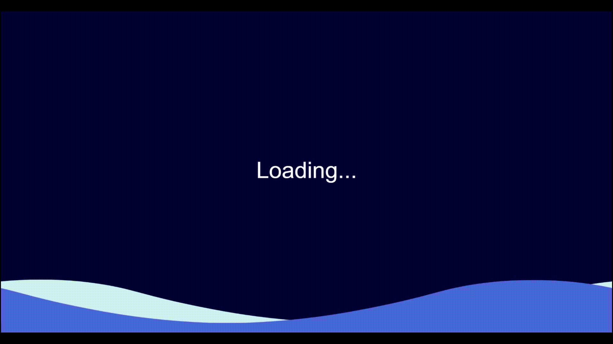

# fhnw-ds-cde1-wettermonitor
Data engineering challenge weather monitor for water sports enthusiasts. 


---

## Hardware
The weather monitor was tested and developed with the following hardware / environment:

- Raspberry Pi 4 Model B
- Raspberry Pi OS (64-bit, with desktop)
   - Release date: September 22nd 2022
   - Kernel version: 5.15
   - Debian version: 11 (bullseye)
- 32 GB Micro SD-Karte
- Waveshare Display 10.1 (HDMI)

## Prerequisites
Following software / hardware is required to set up or run the weather monitor:

- Peripherals (Mouse, Keyboard, Monitor)
- Raspberry Pi OS (64-bit, with desktop)
- Power supply
- Micro SD-Card (32 GB)
- Internet connection

## Installation
1. Download the latest Raspberry Pi OS (64-bit, with desktop) from the [official website](https://www.raspberrypi.org/software/operating-systems/). 
2. Connect the Micro SD card to your computer and flash the downloaded image to the Micro SD card using Raspberry Pi Imager. 
   1. Download the latest version of Raspberry Pi Imager from the [official website](https://www.raspberrypi.org/software/). 
   2. Documentation on how to use Raspberry Pi Imager can be found [here](https://www.raspberrypi.org/documentation/installation/installing-images/README.md).
3. Insert the Micro SD card into the Raspberry Pi and boot the Raspberry Pi.
4. Connect keyboard, mouse and monitor to the Raspberry Pi.
5. Connect the Raspberry Pi to the internet. (If not already configured in step 2)
6. Update the Raspberry Pi OS using the following commands:
   ```bash
   sudo apt update
   sudo apt upgrade
   ```
7. Reboot the Raspberry Pi using the following command:
   ```bash
    sudo reboot
    ```
8. Use the convenience script `install.sh` to install the required dependencies:
    ```bash
    curl -fsSL https://raw.githubusercontent.com/fhnw-ivy/fhnw-ds-cde1-wettermonitor/main/install.sh -o install-weather-monitor.sh
    sudo sh ./install-weather-monitor.sh
    ```

After the script has finished, the Raspberry Pi will reboot automatically. On the next boot, the weather monitor will start automatically.

The installation script will install the following services and applications:
- [Docker](https://www.docker.com/) 
- [Docker Compose](https://docs.docker.com/compose/)
- [InfluxDB](https://www.influxdata.com/products/influxdb-overview/) (Time series database as Docker container)
- Weather Monitor (Docker container with autostart script that opens the dashboard in the browser on boot)
- [Watchtower](https://containrrr.dev/watchtower/) (Service to automatically update Docker containers as Docker container)


## Usage
The startup of the weather monitor can take several minutes. A loading screen is displayed during this time.


After the startup, the dashboard is displayed in the browser. The dashboard shows the current weather data for a specific weather station. The weather station can be selected in the top left corner of the dashboard.

### Dashboard
The dashboard shows the current weather data for a specific weather station. The weather station can be selected in the top left corner of the dashboard.


### Plots


### Predictions


## Troubleshooting
TODO: Describe common problems and solutions.

## Resources

The data for the weather monitor is provided by the following service of the City of Zurich:
- https://tecdottir.herokuapp.com/docs/
- https://data.stadt-zuerich.ch/dataset/sid_wapo_wetterstationen