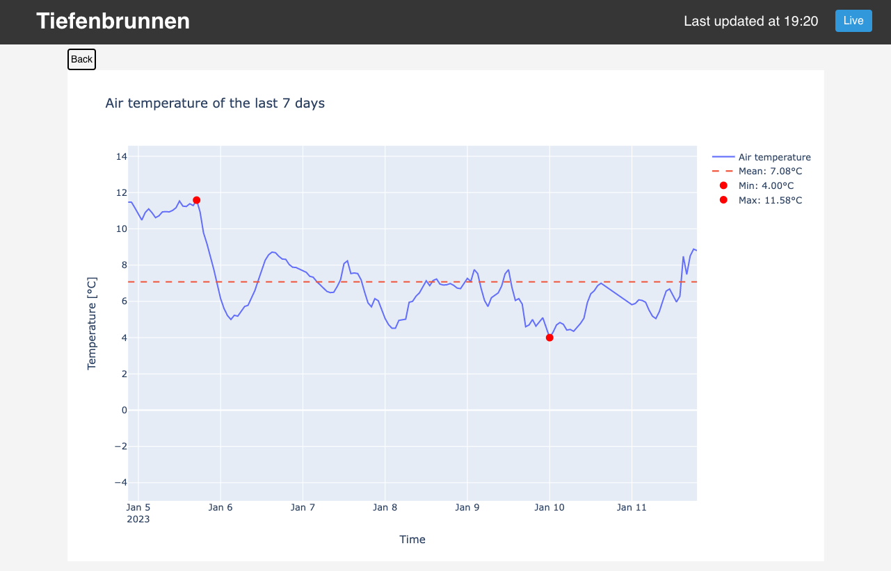

# fhnw-ds-cde1-wettermonitor
Data engineering challenge weather monitor for water sports enthusiasts. The weather monitor aggregates weather data from weather stations and provides a dashboard to visualize the data in order to help water sports enthusiasts to decide when to go out on the water.


---

## Prerequisites
Following software / hardware is required to set up or run the weather monitor:

- Raspberry Pi 4 Model B
- Peripherals (Keyboard, Monitor)
- Power supply
- Micro SD-Card (32 GB)
- Internet connection (WiFi or Ethernet)

## Installation
The installation process was already done beforehand, however, perhaps there may be a desire to set up the device again. Here is a step-by-step guide to set up the weather monitor:

> **Disclaimer:** While the setup is straight forward, it is not trivial. It requires some basic knowledge of Linux and the command line. If you are not familiar with Linux, you may want to contact us or someone else who is familiar with Linux.

1. Connect the Micro SD card to your computer and flash the Raspberry Pi OS (64-bit, with desktop) to the Micro SD card using Raspberry Pi Imager. Here is a simple step by step guide to do this:
   1. Download the latest version of Raspberry Pi Imager from the [official website](https://www.raspberrypi.org/software/). 
   2. Documentation on how to use Raspberry Pi Imager can be found [here](https://www.raspberrypi.com/documentation/computers/getting-started.html#using-raspberry-pi-imager).
2. Connect keyboard and monitor to the Raspberry Pi. (This can be skipped if you are using the Raspberry Pi headless and have configured the WiFi connection in step 1 through the Raspberry Pi Imager)
3. Insert the Micro SD card into the Raspberry Pi and boot the Raspberry Pi.
4. Follow the setup wizard to set up the Raspberry Pi (if not already done with the Raspberry Pi Imager). Documentation on how to set up the Raspberry Pi on the first boot can be found [here](https://www.raspberrypi.com/documentation/computers/getting-started.html#configuration-on-first-boot).
5. Connect the Raspberry Pi to the internet. (If not already configured or done in step 1 or 4). Documentation on how to connect the Raspberry Pi to the internet can be found [here](https://www.raspberrypi.com/documentation/computers/configuration.html#configuring-networking).
6. Update the Raspberry Pi OS using the following commands:
   ```bash
   sudo apt update
   sudo apt upgrade
   ```
7. Reboot the Raspberry Pi using the following command:
   ```bash
    sudo reboot
    ```
8. Use the convenience script `install.sh` to install the required dependencies:
    ```bash
    curl -fsSL https://raw.githubusercontent.com/fhnw-ivy/fhnw-ds-cde1-wettermonitor/main/install.sh -o install-weather-monitor.sh
    sudo sh ./install-weather-monitor.sh
    ```
   > **Note**: This could take a while... At the end of the installation, the Raspberry Pi will reboot automatically. Make sure to not interrupt the installation process by disconnecting the Raspberry Pi from the power supply or by closing the terminal window.
9. After the reboot, the weather monitor should be up and running.

From now on the weather monitor will start automatically on every boot.

## Usage
The startup of the weather monitor may take several minutes. A loading screen is displayed during this time.


After the startup, the dashboard is displayed in the browser.

In the top left corner the 'Intro' button can be used to start the intro. The intro shows the functionality of the weather monitor in a hands-on way.


In the background, the weather monitor is collecting data from the different weather stations periodically. The data is then automatically displayed in the dashboard and plots as well as predictions are updated in the background.

### User Interface


The dashboard shows the current weather data for a specific weather station. The weather station can be selected in the top left corner of the dashboard, by clicking on the weather station name. 


The dashboard provides you with not only the current weather data, but also with a wind forecast for the next hour. The wind forecast is based on the current weather data and a machine learning model (KNN). 

Besides the wind data, the dashboards includes a slider with different plots for the weather data of the past 24 hours. Each plot is clickable and opens a detailed and larger view of the plot in order to dig deeper into the data.


---

## Q&A

### How can I change or reconnect the Wi-Fi?
Documentation on how to change or reconnect the Wi-Fi on the Raspberry Pi can be found [here](https://www.raspberrypi.com/documentation/computers/configuration.html#configuring-networking).

### Can I use the weather monitor in fullscreen mode?
Yes, the weather monitor can be used in fullscreen mode. To use the weather monitor in fullscreen mode, press `F11` on the keyboard. 

Alternatively, you can use the Chromium browser menu to switch to fullscreen mode. Documentation on how to switch the Chromium browser to fullscreen mode can be found [here](https://techcult.com/how-to-go-full-screen-in-google-chrome/) (Same procedure for Chromium browser).

To leave the fullscreen mode without a keyboard, long press in the top center of the screen. A close symbol will appear in the top center of the screen. Click on the close symbol to leave the fullscreen mode.

### How can I restart the weather monitor?
To restart the weather monitor, simply use the following command:
```bash
sudo reboot
```
Alternatively, you can disconnect the Raspberry Pi from the power supply, wait a few seconds and reconnect it to the power supply again. 

### How can I update the weather monitor?
The weather monitor is usually **automatically updated**. If you want to update the weather monitor manually, use the following command:
```bash
sudo docker-compose pull
```

### What if my screen is flickering or nothing is displayed?
Read the section [How can I restart the weather monitor?](#how-can-i-restart-the-weather-monitor) and use the alternative method to restart the weather monitor.

### I can't see the dashboard in the browser. What can I do?
Following steps can be taken to solve this issue:
1. Check if the Raspberry Pi is connected to the internet (WiFi or Ethernet). Check the section [How can I change or reconnect the Wi-Fi?](#how-can-i-change-or-reconnect-the-wi-fi) for more information.
2. Reboot the Raspberry Pi. Read the section [How can I restart the weather monitor?](#how-can-i-restart-the-weather-monitor) for more information.
3. If the issue still persists, contact us or reboot the Raspberry Pi again.

### The Raspberry Pi is connected to the internet, but the weather monitor is showing it is offline. What can I do?
This may be due to errors while retrieving data. It usually resolves itself after a few minutes. 

If the issue still persists, contact us or reboot the Raspberry Pi. Read the section [How can I restart the weather monitor?](#how-can-i-restart-the-weather-monitor) for more information.

## Known Issues
### Screen flickering
If the screen is flickering, try to restart the weather monitor. If the screen is still flickering, try to use a different HDMI cable.

It is suspected that the screen flickering is caused by the power supply. If you are using a power supply with a lower wattage, try to use a power supply with a higher wattage. This might solve the issue.

> **Caution**: Be careful when using a power supply with a higher wattage. Using a power supply with a higher wattage might damage the Raspberry Pi.

## Resources
The data for the weather monitor is provided by the following services of the City of Zurich:
- https://tecdottir.herokuapp.com/docs/
- https://data.stadt-zuerich.ch/dataset/sid_wapo_wetterstationen