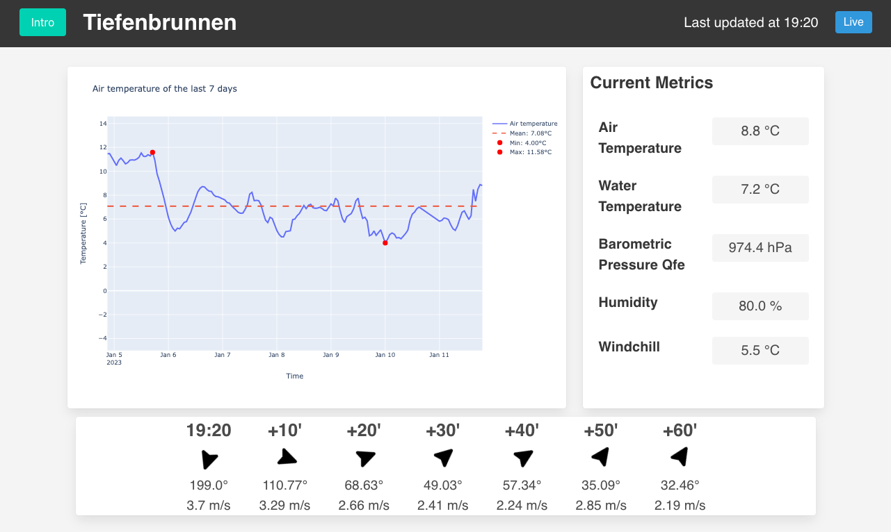

# fhnw-ds-cde1-wettermonitor
Data engineering challenge weather monitor for water sports enthusiasts. The weather monitor aggregates weather data from weather stations and provides a dashboard to visualize the data in order to help water sports enthusiasts to decide when to go out on the water.



---

## Tested and developed on
The weather monitor was tested and developed with the following environment:

- Raspberry Pi 4 Model B
- Raspberry Pi OS (64-bit, with desktop)
   - Release date: September 22nd 2022
   - Kernel version: 5.15
   - Debian version: 11 (bullseye)
- 32 GB Micro SD-Karte
- Waveshare Display 10.1 (HDMI)

## Prerequisites
Following software / hardware is required to set up or run the weather monitor:

- Peripherals (Keyboard, Monitor)
- Raspberry Pi OS (64-bit, with desktop)
- Power supply
- Micro SD-Card (32 GB)
- Internet connection

## Installation
1. Connect the Micro SD card to your computer and flash the Raspberry Pi OS (64-bit, with desktop) to the Micro SD card using Raspberry Pi Imager. 
   1. Download the latest version of Raspberry Pi Imager from the [official website](https://www.raspberrypi.org/software/). 
   2. Documentation on how to use Raspberry Pi Imager can be found [here](https://www.raspberrypi.com/documentation/computers/getting-started.html#using-raspberry-pi-imager).
2. Connect keyboard and monitor to the Raspberry Pi. (This can be skipped if you are using the Raspberry Pi headless and have configured the WiFi connection in step 1 through the Raspberry Pi Imager)
3. Insert the Micro SD card into the Raspberry Pi and boot the Raspberry Pi.
4. Follow the setup wizard to set up the Raspberry Pi (if not already done with the Raspberry Pi Imager). Documentation on how to set up the Raspberry Pi on the first boot can be found [here](https://www.raspberrypi.com/documentation/computers/getting-started.html#configuration-on-first-boot).
5. Connect the Raspberry Pi to the internet. (If not already configured or done in step 1 or 4). Documentation on how to connect the Raspberry Pi to the internet can be found [here](https://www.raspberrypi.com/documentation/computers/configuration.html#configuring-networking).
6. Update the Raspberry Pi OS using the following commands:
   ```bash
   sudo apt update
   sudo apt upgrade
   ```
7. Reboot the Raspberry Pi using the following command:
   ```bash
    sudo reboot
    ```
8. Use the convenience script `install.sh` to install the required dependencies:
    ```bash
    curl -fsSL https://raw.githubusercontent.com/fhnw-ivy/fhnw-ds-cde1-wettermonitor/main/install.sh -o install-weather-monitor.sh
    sudo sh ./install-weather-monitor.sh
    ```
   > **Note**: This could take a while... At the end of the installation, the Raspberry Pi will reboot automatically. Make sure to not interrupt the installation process by disconnecting the Raspberry Pi from the power supply or by closing the terminal window.
9. After the reboot, the weather monitor should be up and running.

From now on the weather monitor will start automatically on every boot.

The installation script will install the following services and applications:
- [Docker](https://www.docker.com/) 
- [Docker Compose](https://docs.docker.com/compose/)
- [InfluxDB](https://www.influxdata.com/products/influxdb-overview/) (Time series database as Docker container)
- Weather Monitor (Docker container with autostart script that opens the dashboard in the browser on boot)
- [Watchtower](https://containrrr.dev/watchtower/) (Service to automatically update Docker containers as Docker container)

The services and applications restart automatically after a reboot.

## Usage
The startup of the weather monitor can take several minutes. A loading screen is displayed during this time.


After the startup, the dashboard is displayed in the browser.

In the top left corner the 'Start Intro' button can be used to start the intro. The intro shows the functionality of the weather monitor in a hands-on way.

In the background, the weather monitor is collecting data from the different weather stations periodically. The data is then automatically displayed in the dashboard and plots as well as predictions are updated in the background.

### Dashboard
The dashboard shows the current weather data for a specific weather station. The weather station can be selected in the top left corner of the dashboard.


### Plots


### Predictions


## Q&A
### How can I change or reconnect the Wi-Fi?
Documentation on how to change or reconnect the Wi-Fi on the Raspberry Pi can be found [here](https://www.raspberrypi.com/documentation/computers/configuration.html#configuring-networking).

### Can I use the weather monitor in fullscreen mode?
Yes, the weather monitor can be used in fullscreen mode. To use the weather monitor in fullscreen mode, press `F11` on the keyboard. 

Alternatively, you can use the Chromium browser menu to switch to fullscreen mode. Documentation on how to switch the Chromium browser to fullscreen mode can be found [here](https://techcult.com/how-to-go-full-screen-in-google-chrome/) (Same procedure for Chromium browser).

To leave the fullscreen mode without a keyboard, long press in the top center of the screen. A close symbol will appear in the top center of the screen. Click on the close symbol to leave the fullscreen mode.

### How can I restart the weather monitor?
To restart the weather monitor, simply use the following command:
```bash
sudo reboot
```
Alternatively, you can disconnect the Raspberry Pi from the power supply, wait a few seconds and reconnect it to the power supply again. 

### How can I update the weather monitor?
The weather monitor is usually **automatically updated**. If you want to update the weather monitor manually, use the following command:
```bash
sudo docker-compose pull
```

### What if my screen is flickering or nothing is displayed?
Read the section [How can I restart the weather monitor?](#how-can-i-restart-the-weather-monitor) and use the alternative method to restart the weather monitor.

## Resources
The data for the weather monitor is provided by the following services of the City of Zurich:
- https://tecdottir.herokuapp.com/docs/
- https://data.stadt-zuerich.ch/dataset/sid_wapo_wetterstationen